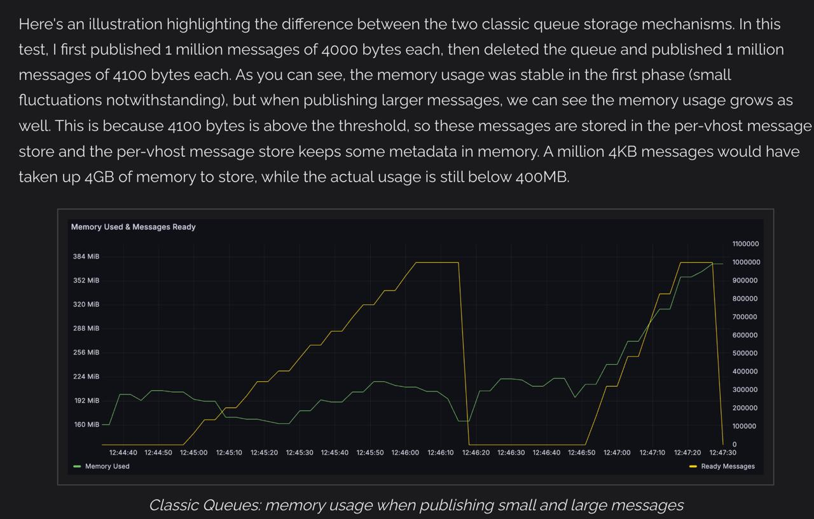

# RabbitMqExperiments

Rabbit MQ

Durable: msgs will be writen to disk and acknowledged by the broker once they are written to disk

Lazy: avoid overloading all of msgs in memory at broker

ConsumerPriority: set certain consumers higher

ExchangeType: By default MassTransit uses fanout exchange

There used to be channel specific QualityOfService where you cpuld specify prefetch count on channel, but with quorom queues cant use global QoS

Two exchanges are created:
For the event
First exchange binds to another exchange which maps 1 on 1 to the queue (mass transit creates an exchnage with the same name as queue, mass transit creates these exchanges as fanout)  

2 gives mass transit added benifits e,g, I wanna keep copy of every message sent to an endpoint:
set a wire tap by adding another queue to the same exchange

To send directly to a queue,
either specify a blank exchange and set routing key = queue name (means you can use the routing key for routing)
or you can send to exchange that’s bound to the queue

Mass transit supports 2 modes of sending:
Send  
Publish
Send need to getSendEndpoint
Publsh does not, here it looks at msg type to get the destination address.
In our case it finds an exchange of same type as message, and sends it to that exchange
(anything bound to that exchange will get a copy of the msg, if there are multiple queues bound to that exchange
aka multiple queues listening to same msg type, both will receive the same msg)

Each recieve endpoint gets its own channel in rabbitmq

Skipped queues
Create endpoint named account-service
Register consumer in that endpoint listening to msgs of type T
Bind an exchange named account to the queue/exchange account-service (since 1:1 mapping)

GetSendEndpoint pointing to exchange named account
Send message of type T to it, it is processed by consumer
Send message of type X to it, a skipped queue is created on the name of queue (account-service-skipped),
since consumer for X is not configured on queue pointed to by exchange account

—
Messages are not published directly to queues but exchanges.
Binding: A link b/q queue and an exchange
Connection: A TCP connection b/w .net application and RabbitMQ broker
Channel: A virtual connection inside a connection. When publishing/consuming events from queue, it is all done over a channel.

Types of exchanges:
Default: pre-declared direct exchange with no name, usually referred by an empty string. Every queue is automatically bound to the default exchange with a routing key which is the same as the queue name.
Direct: The message is routed to the queues whose binding key exactly matches the routing key of the message
Fanout: fanout exchange routes messages to all of the queues bound to it.
Topic: topic exchange does a wildcard match between the routing key and the routing pattern specified in the binding.

1 connection aka TCP connection per application, denoted by cfg.Host(hostName);
Each consumer gets its own channel inside the connection.
For producer there may or may not be multiple channels per each event.
But same channels for publish and consuming can’t be used because
if consumer is taking long time to process, publisher may be blocked to push more messages, thread safety issue can also occur.

Where does rabbitMq stores its messages?

It used to store it in memory 10 years ago.
It changed.

1. Classic Queues
Accumulates incoming messages in memory buffer.
Writes them to disk in batch, as soon as memory buffer is full. Flushes the buffer then.
Writes also happen, after certain number of batch messages received, or certain num
of operations are peformend on the batch. Needless to say, buffer is flushed then.
If none of above happen, writes happen to disk and buffer is flushed every 200 ms.

	Messages < 4kb stored in per-queue message store.
	Messages > 4kb stored in per-vhost message store.

       

	Sometimes, there is no disk activity in RabbitMq.
	Reason is before the in-memory messages are stored to disk, 
	they are consumed and acknowledged by the consumers whose buffers have ample space, 
	likely due to high prefetchCount setting. In that case messages are immediately
	forwarded to consumers, and once acknoeldged they are never persisted on disk, simply removed from memory.

Transient vs Persistent message:
For persistent message: confirm is sent to publisher (yes, publisher) when
Either msg written to disk ()
Or msg delivered and acked by consumer
For transiet message: confirm is sent to publisher
as soon as msg lands in queue

Fsync must to confirm succesful persistence on disk.
Classic queues call it in some cases.
But publisher confirm events are sent with or w/o fsync.
So, in case of power loss messages may still be lost - even durable ones.
For more durability, use quorom queues.

2. Quorom Queues: 
Always calls fsync.
If a publisher recieves confirm, fsync has already been called on majority nodes in the quorom.
In case rabbitMq is overloaded, too many messages in mailbox, they are simply not confirmed to publisher.
So, even if they are lost in power outage, publisher was never confirmed (and as per my intuition should simply retry).