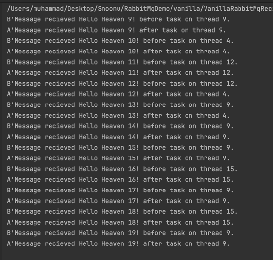
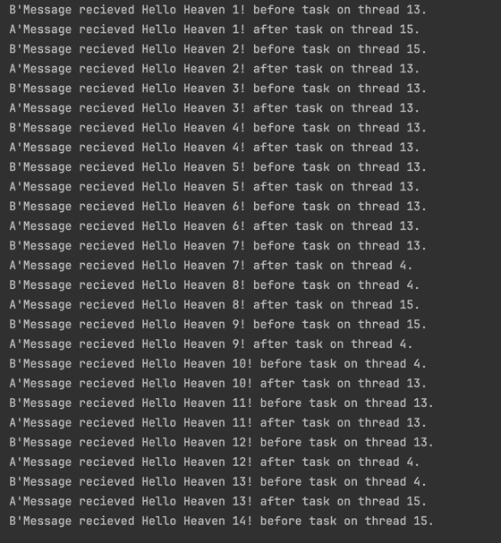
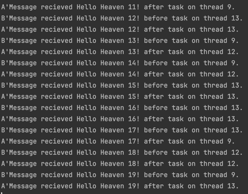
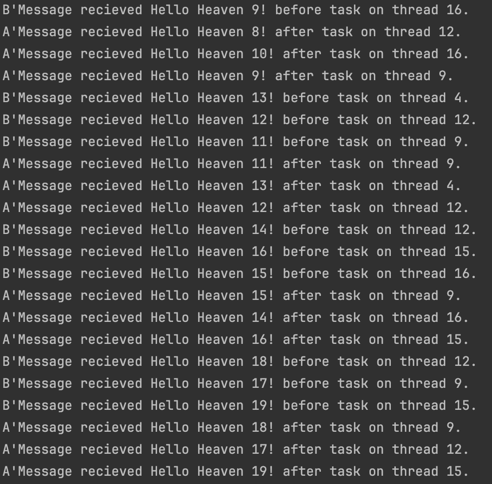

### PrefetchCount = 1, async task.delay
Consumer only processes 1 message at a time.
Awaiting Task.delay releases the thread to thread pool.
Once done, the same thread may be re deployed to resume remaining code after await.
This happens to be the case in most of the cases below.

### PrefetchCount = 2, async task.delay
Consumer still only processes 1 message at a time.
Even with increased delay, it is still processing 1 message before processing next.
However, thread variation is more pronounced before and after await.

### PrefetchCount = 1, task.run
Since we ack after task.delay, next message is not recieved by the consumer.
So, we still see sequential processing of messages.

### PrefetchCount = 3, task.run
Now it is running on multiple threads.
